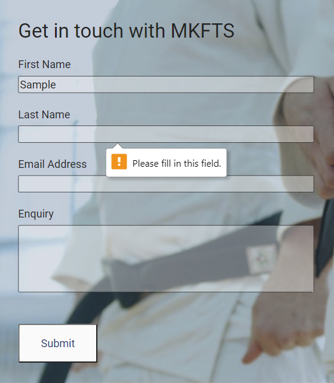
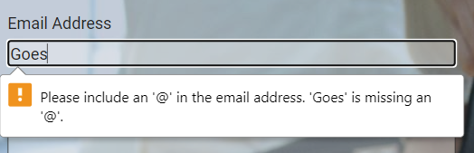
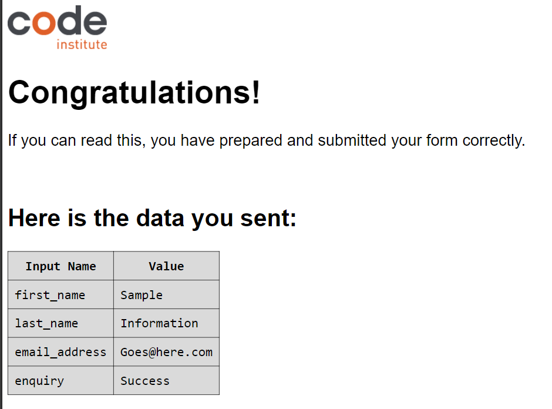
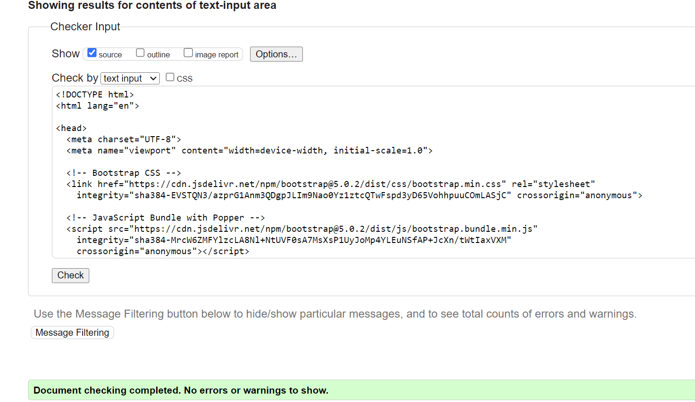
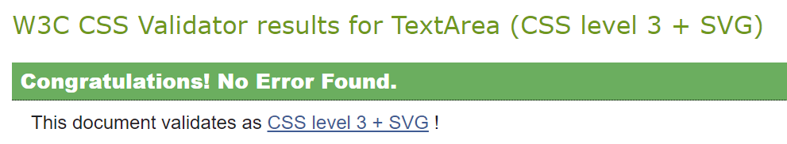

# MKFTS

## The Milton Keynes Federation of Traditional Shotokan

This is a website designed for MKFTS, a fictional karate club. It is a site with three aims in mind: first, to advertise to visitors that the club exists and where/when it can be accessed; second, to encourage and motivate a visitor to begin taking karate classes, through text and images; and third, to give visitors a little information about Shotokan karate in general. The site is targeted primarily towards those new to the hobby, but would contain information that would be useful for existing practitioners as well. MKFTS's main use would be to advertise club times and locations - the most important information for anyone visiting.

The site is designed to work on three different screen sizes, including Desktop, Tablet and Phone sizes.

## User Stories
As a newcomer to the hobby, I want (in order):
+ Visuals that give me a general idea of the club, and are eye-catching
+ Some questions/answers about why I would want to do this as a hobby
+ Information about the locations of clubs
+ Information about the times of clubs
+ Confirmation that the hobby is safe, that instructors are insured, etc.
+ The ability to get in touch should I not just want to turn up
+ Some extra information so I don't feel like I know nothing

As an existing member of the club, I want:
+ A reminder of information for organisation - where sessions are, when they are
+ The ability to get in touch with teachers between sessions

As a caregiver for a member of the club, I want:
+ Information that might help get my dependent to their club - where and when
+ Information about the adults I am trusting my dependent to
+ Knowledge that those adults are safe, insured, etc

## Features
This site comprises four pages: a home page, an 'about' page, a 'clubs' page and a 'contact' page.

### Common Features
All four pages have the following features in common:

#### Header with Nav Bar

The header includes a text logo that is clickable, taking the user to the home page; and a menu with clickable links to all four pages. The curently-selected page is underlined, clearly indicating to the user where they are. This is identical across all four pages, and easily allows the user to navigate the website without becoming lost or using the 'back' button. For the phone, this will aim to include a hamburger-style menu which opens in a menu with the same four options and styling. Example generated in Figma.

#### Hero Image
All four pages have a Hero image of identical size (with one small exception - see Contact for Desktop page). This image is consistent across three different screen sizes, although cropping may differ. This image also contains a box-out in blue that contains text in white, giving the full name of the site and also tying in to the key colour palette used throughout, in #104678 with 60% opacity. These hero images have a gentle animation, easing in, to catch the eye and assure the user that the website is functioning.  Example generated in Figma.

#### Footer
All four pages have the same social-media links in grey, in grey #7D7D7D. Example generated in Figma.

## Wireframe
### Features Unique to the Home Page
 
 

The Home page in all formats has, in addition to the common features, three or four 'why study karate' text areas. Tablet and Desktop have a central image; phone loses this image in favour of space-saving. Below this, four training sessions are called out - landscape on tablet and desktop, portrait on phone. These are click-through, taking the user to the Clubs page.

### Features Unique to the Clubs Page
 
 

The Clubs page in all formats has, in addition to the common features, detail cards for three clubs. These cards include a portrait picture of the teacher for the club; text information detailing the time, location and cost of classes; and, taking up the same width as both the text and the picture, a Google Map embedded. On the Phone, these are displayed full-width in a vertical stack; on Tablet, there are two to a line, with the third centred; on Desktop, all three are displayed inline.

### Features Unique to the About Page
 
 

The About page in all formats has, in addition to the common features, two text blocks that detail some interesting information for the user. Terms such as 'karate' and 'shotokan' may not be familiar to a newcomer; this page is primarily for these users. The second block of text also contains important information about DBS checks and first-aid certification. The first block is wrapped tightly around a square picture.

### Features Unique to the Contact Page
 
 

The Contact page in all formats has, in addition to the common features, a contact form featuring text inputs for Name, Email and Enquiry, as well as a Submit button. On Desktop, the Hero image is unclipped with the 'Contact us' section overlapping it. On both Tablet and Phone, the regular layout is preserved. The button is in #104678 to match the boxouts over the Hero images.

## Upcoming features
Gallery - currently not implemented, but would be a logical fifth page, linked from the Clubs page, possibly with each club having their own gallery.

## Technology
This website was made in its entirety using Visual Code Studio. Initially having been introduced to CodeAnywhere through the Code Institute, I made the decision very early on to use VSC exclusively as a way of combating the long load times and instability of CodeAnywhere. Additional software used to create this website include Photoshop for image editing and Chrome for previewing, inspecting and bug testing.

## Testing
### Test Cases
Main test case: Contact form
+ Input in just the First Name field returns a popup error 'Please fill in this field' in the next topmost empty field.
+ Input in just the Last Name field returns a popup error 'Please fill in this field' in the topmost empty field.
+ Input in just the Email Address field returns a popup error 'Please fill in this field' in the topmost empty field.
+ Input in just the Enquiry field returns a popup error 'Please fill in this field' in the topmost empty field.
+ Inputs in any combination that don't include a full set of inputs return the popup error 'Please fill in this field' in the topmost empty field.
+ Inputs into the Email Address field that do not use proper email address format return the error 'Please include an @ in the email address.'
 
 
+ Inputs present in all four input fields, with correct email format used, returns the following success screen (currently directing to the Code Institute form submission)
 
Result: Works as expected

Secondary test case: Newcomer user journey
+ As a newcomer to the site, the desired information is on the front page - places, dates, times. 
+ Additional information is included - safety, reasons to want to train
+ Thought is given to the visuals - a range of people are visible across the pages, and they are good-quality and eye-catching
Result: Works as expected

Secondary test case: Experienced user journey
+ As someone who knows what information they are looking for, the desired information is on the front page - places, dates, times. 
+ Contact information hidden to prevent spam - all contact is through the Contact page
+ Thought is given to the visuals - a range of people are visible across the pages, and they are good-quality and eye-catching
Result: Works as expected

### Bugs discovered
I had a lot of trouble with the circular image on the index.html page. It pushed much of the content around on smaller screen sizes, and iPad Pro in particular was slightly larger than the 'medium' screen size for Bootstrap, meaning that it needed some specific code to ensure the image and text were aligned properly. Ultimately, adding in a column in the centre to properly align the text at lower screen resolutions solved the problem.

I had a great deal of problem making the hero and navbar not overflow at the lowest screen sizes. This caused horizontal scrolls in screen sizes that weren't huge. In the end, after a lot of work with the Inspect tool, I traced the problem to rows in Bootstrap seemingly having -12px margins. Removing the margins removed the problem.

## Code validation
<a href="https://validator.w3.org/" target="_blank">W3C</a>

 

<a href="https://jigsaw.w3.org/" target="_blank">Jigsaw</a>

 

## Supported Screens and Browsers
This website works in any browser and at any screen size, from desktop down to smart phones. It has been developed and tested in Chrome, and smaller screen sizes have been simulated with Chrome's Inspect tool. Sample screens of all currently-available smart phones have been tested.

## Deployment
This website has been deployed on Github Pages. It was developed locally, using a clone of the repository on Github, available at <a href="https://github.com/stevecook23/MKFTS" target="_blank">Github</a>. The Visual Studio Code preview extension was used to preview the website. The deployment list is available <a href="https://github.com/stevecook23/MKFTS/actions" target="_blank">here</a>.

## Credits
### Content
Text is written in its entirety by Steve Cook, with some inspiration taken from www.cfts-karate.co.uk, also by Steve Cook.

### Media
#### Images
Images used in the site have been sourced through Pexels Stock Images  and are used by permission. They can be found at the following addresses:

<a href="https://www.pexels.com/photo/close-up-shot-of-two-people-wearing-karategi-and-black-belt-6253307/" target="_blank">Index and Contact page Hero image</a>

<a href="https://www.pexels.com/photo/woman-doing-a-karate-pose-6005472/" target="_blank">Circle image on Index page</a>

<a href="https://www.pexels.com/photo/a-man-doing-a-karate-punch-7045749/" target="_blank">First instructor image on Clubs page</a>

<a href="https://www.pexels.com/photo/woman-in-white-judo-uniform-7045407/" target="_blank">Second instructor image on Clubs page</a>

<a href="https://www.pexels.com/photo/a-man-in-white-gi-teaching-karate-9651864/" target="_blank">Third instructor image on Clubs page</a>

<a href="https://www.pexels.com/photo/mt-fuji-japan-1108701/" target="_blank">Hero image on About page</a>

<a href="https://www.pexels.com/photo/man-people-woman-girl-7045605/" target="_blank">Clubs Page Hero image</a>